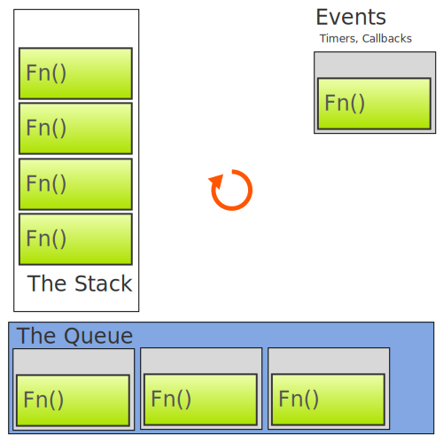

# Event Loop Lag

---

### The Event Loop



---

```javascript
// pseudo-code (quick & dirty at that!)
const event_queue = [];
const event_refs = {
 // References to timers, I/O callbacks, etc.
 // These often keep the process running.
};
// the loop - NOT actually implemented this way!!!!!
while (true) {
  let fn = event_queue.shift();
  if (fn) {
    // Each function starts a new execution stack
    // that must run to completion before the next
    // function in the queue can execute.
    fn();
  }
}
```

---

### The stack

When a function is pulled off the queue it starts a new execution stack

----

The function will proabably call other functions

+ adding layers to the stack

----

A call stack may schedule other work

+ Timers
+ Async I/O
+ Promises
+ Event Listeners

----

Flame Charts show the execution stack over time

---


And the queue just waits for the stack to finish...

---

Functions don't go in the queue until they are ready to run! 
(conceptually at least)

---

## Event Loop Lag

+ a measure of how long a function had to wait in the queue to run

----

```javascript
// TODO: sample code
```
